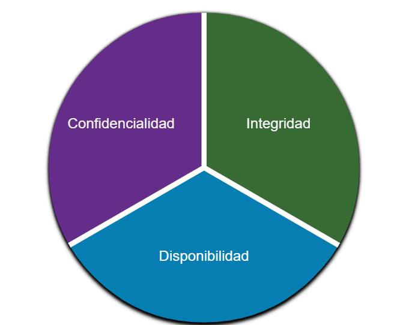
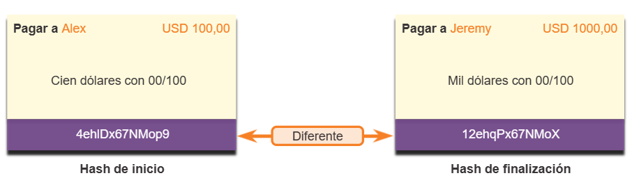
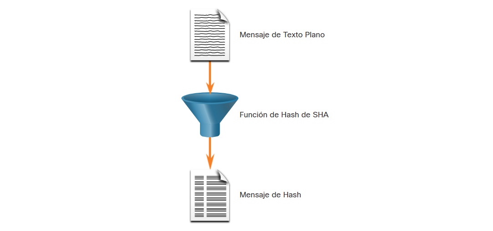
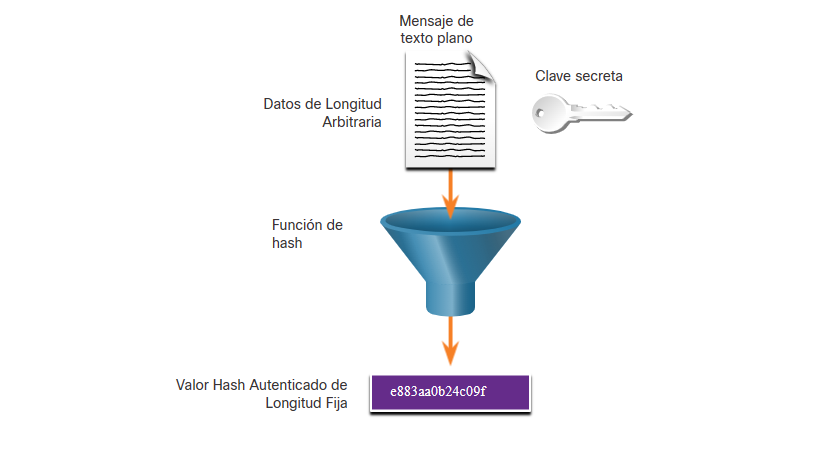
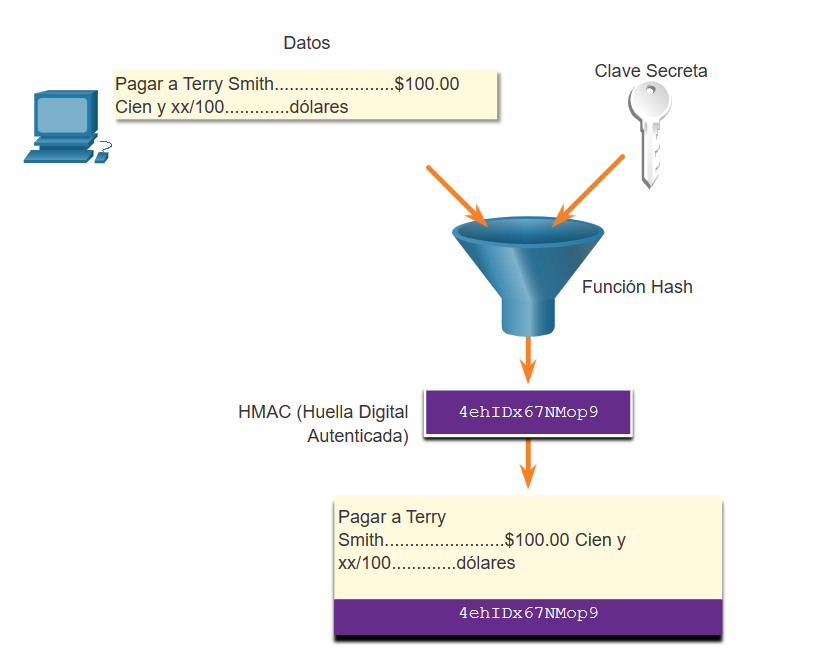
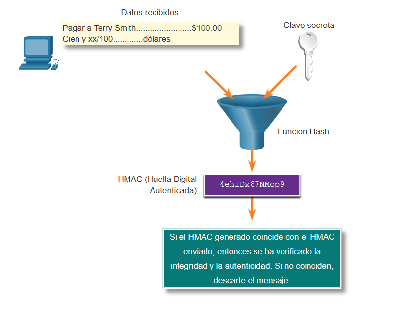
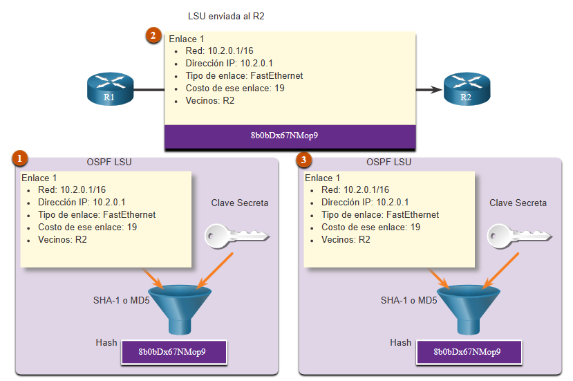
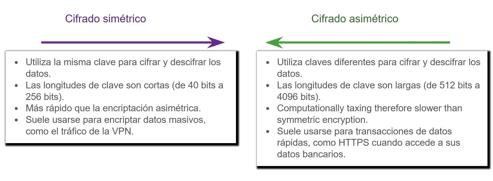

# 1. Seminario

- [1. Seminario](#1-seminario)
  - [1.1. Criptografía](#11-criptografía)
  - [1.2. Confidencialidad, Integridad y Disponibilidad](#12-confidencialidad-integridad-y-disponibilidad)
    - [1.2.1. Asegurando las comunicaciones](#121-asegurando-las-comunicaciones)
    - [1.2.2. Integridad de los datos](#122-integridad-de-los-datos)
    - [1.2.3. Función de Hash](#123-función-de-hash)
      - [1.2.3.1. MD5 con una síntesis de 128 bits](#1231-md5-con-una-síntesis-de-128-bits)
      - [1.2.3.2. Algoritmo de Hashing de SHA](#1232-algoritmo-de-hashing-de-sha)
      - [1.2.3.3. SHA-2](#1233-sha-2)
      - [1.2.3.4. Autenticación de Origen](#1234-autenticación-de-origen)
        - [1.2.3.4.1. Algoritmo de Hashing de HMAC](#12341-algoritmo-de-hashing-de-hmac)
        - [1.2.3.4.2. Creando un valor HMAC](#12342-creando-un-valor-hmac)
        - [1.2.3.4.3. Verificando un valor HMAC](#12343-verificando-un-valor-hmac)
        - [1.2.3.4.4. Ejemplo de HMAC en Cisco Router.](#12344-ejemplo-de-hmac-en-cisco-router)
    - [1.2.4. Cifrado por sustitución](#124-cifrado-por-sustitución)
    - [1.2.5. Cifrado por transposición](#125-cifrado-por-transposición)
    - [1.2.6. Rellenos de una sola vez](#126-rellenos-de-una-sola-vez)
    - [1.2.7. Principios criptográficos](#127-principios-criptográficos)
  - [1.3. Confidencialidad de los Datos](#13-confidencialidad-de-los-datos)
  - [1.4. Algoritmos de clave simétrica](#14-algoritmos-de-clave-simétrica)
    - [1.4.1. DES: Estándar de Encriptación de Datos](#141-des-estándar-de-encriptación-de-datos)
    - [1.4.2. AES: Estándar de Encriptación Avanzada](#142-aes-estándar-de-encriptación-avanzada)
  - [1.5. Modos de sistema de cifrado](#15-modos-de-sistema-de-cifrado)
    - [1.5.1. Otros sistemas de cifrado](#151-otros-sistemas-de-cifrado)
    - [1.5.2. Cripto-análisis](#152-cripto-análisis)
  - [1.6. Algoritmos de clave pública](#16-algoritmos-de-clave-pública)
    - [1.6.1. RSA: Rivest, Shamir, Adleman](#161-rsa-rivest-shamir-adleman)
    - [1.6.2. Otros algoritmos de clave pública](#162-otros-algoritmos-de-clave-pública)
  - [1.7. Firmas digitales](#17-firmas-digitales)
    - [1.7.1. Firmas de clave simétrica](#171-firmas-de-clave-simétrica)
    - [1.7.2. Firmas de clave pública](#172-firmas-de-clave-pública)
    - [1.7.3. Resúmenes de mensaje](#173-resúmenes-de-mensaje)
    - [1.7.4. Implementación práctica de firmas digitales en Nicaragua, México y España](#174-implementación-práctica-de-firmas-digitales-en-nicaragua-méxico-y-españa)

## 1.1. Criptografía

## 1.2. Confidencialidad, Integridad y Disponibilidad

Es cierto que la lista de tipos de ataques de red es larga. Pero hay muchas mejores prácticas que puede usar para defender su red.

La seguridad de la red consiste en proteger la información y los sistemas de información del acceso, uso, divulgación, interrupción, modificación o destrucción no autorizados.

La mayoría de las organizaciones siguen la triada de seguridad de la información de la CIA:

- **Confidencialidad -** Solamente individuos, entidades o procesos autorizados pueden tener acceso a información confidencial. Puede requerir el uso de algoritmos de cifrado criptográfico como AES para cifrar y descifrar datos.
- **Integridad -** se refiere a proteger los datos de modificaciones no autorizadas. Requiere el uso de algoritmos de hashing criptográficos como SHA.
- **Disponibilidad -** Los usuarios autorizados deben tener acceso ininterrumpido a los recursos y datos importantes. Requiere implementar servicios redundantes, puertas de enlace y enlaces.

**La criptografía** es el estudio y la práctica de técnicas que se utilizan para asegurar la comunicación y proteger la información de accesos no autorizados o modificaciones no deseadas. Se basa en principios matemáticos y algoritmos para transformar datos en forma ilegible, llamados texto cifrado, que solo pueden ser interpretados por personas o sistemas autorizados que poseen la clave de descifrado adecuada.

### 1.2.1. Asegurando las comunicaciones

Las organizaciones deben proporcionar soporte para proteger los datos a medida que viajan a través de enlaces. Esto puede incluir el tráfico interno, pero la mayor preocupación es proteger los datos que viajan fuera de la organización a sitios de sucursales, teletrabajadores y partners.

Estos son los cuatro elementos de las comunicaciones seguras:

- **Integridad de los Datos -** Garantiza que el mensaje no se haya modificado. Se detecta cualquier cambio en los datos en tránsito. La integridad se garantiza mediante la aplicación de los algoritmos de generación de hash Message Digest versión 5 (MD5) o Secure Hash (SHA).
- **Autenticación de origen -** para garantizar que el mensaje no sea falso y que el remitente sea el verdadero. Muchas redes modernas garantizan la autenticación con protocolos, como el código de autenticación de mensaje hash (HMAC, Hash Message Authentication Code).
- **Confidencialidad de los datos -** garantiza que solamente los usuarios autorizados puedan leer el mensaje. Si se intercepta el mensaje, no se puede descifrar en un plazo razonable. La confidencialidad de los datos se implementa utilizando algoritmos de encriptación simétrica y asimétrica.
- **Imposibilidad de negación de los datos -** garantiza que el remitente no pueda negar ni refutar la validez de un mensaje enviado. La imposibilidad de negación se basa en el hecho de que solamente el remitente tiene características o una firma únicas relacionadas con el tratamiento del mensaje.

La criptografía puede usarse casi en cualquier lugar donde haya comunicación de datos. De hecho, estamos yendo hacia un mundo donde toda la comunicación se encriptará.

### 1.2.2. Integridad de los datos

Las funciones de hash se utilizan para garantizar la integridad de un mensaje. Garantizan que los datos del mensaje no hayan cambiado accidental o intencionalmente.

En la figura 1, el remitente envía una transferencia de USD $100 a Alex.

El algoritmo hash funciona de la siguiente manera:

1. El dispositivo de envío ingresa el mensaje en un algoritmo hash y calcula su hash de longitud fija de **4ehiD×67NMop9**.
2. Luego, este hash se adjunta al mensaje y se envía al receptor. El mensaje y el hash se transmiten en texto sin formato.
3. El dispositivo receptor elimina el hash del mensaje e introduce el mensaje en el mismo algoritmo de hash. Si el hash calculado es igual al que se adjunta al mensaje, significa que el mensaje no se modificó durante su recorrido. Si los hash son no iguales, como se ve en la figura, ya no es posible garantizar la integridad del mensaje.

### 1.2.3. Función de Hash

Existen tres funciones de hash muy conocidas:

#### 1.2.3.1. MD5 con una síntesis de 128 bits

MD5 es una función unidireccional que produce un mensaje hash de 128 bits, como se muestra en la figura. MD5 es un algoritmo heredado que solo debe usarse cuando no hay mejores alternativas disponibles. Use SHA-2 en su lugar.

En la figura, se pasa un mensaje de texto sin formato a través de una función hash MD5. El resultado es un mensaje hash de 128 bits.

#### 1.2.3.2. Algoritmo de Hashing de SHA

SHA-1 es muy similar a las funciones hash MD5, como se muestra en la figura. Existen numerosas versiones. SHA-1 crea un mensaje hash de 160 bits y es un poco más lento que MD5. SHA-1 tiene defectos conocidos y es un algoritmo obsoleto. Use SHA-2 cuando sea posible.

En la figura, se pasa un mensaje de texto sin formato a través de una función hash SHA. El resultado es un mensaje hash de 128 bits.

#### 1.2.3.3. SHA-2

Esto incluye SHA-224 (224 bit), SHA-256 (256 bit), SHA-384 (384 bit) y SHA-512 (512 bit). SHA-256, SHA-384 y SHA-512 son algoritmos de última generación y deben utilizarse siempre que sea posible.

Mientras que el hash se puede utilizar para detectar modificaciones accidentales, no brinda protección contra cambios deliberados. No existe información de identificación única del emisor en el procedimiento de hash. Esto significa que cualquier persona puede calcular un hash para los datos, siempre y cuando tengan la función de hash correcta.

Por ejemplo, cuando un mensaje pasa por la red, un atacante potencial puede interceptarlo, cambiarlo, o re-calcular el hash y añadirlo al mensaje. El dispositivo receptor solo validará el hash que esté añadido.

Por lo tanto, el hash es vulnerable a los ataques man-in-the-middle y no proporciona seguridad a los datos transmitidos. Para proporcionar integridad y autenticación de origen, se necesita algo más.

#### 1.2.3.4. Autenticación de Origen

##### 1.2.3.4.1. Algoritmo de Hashing de HMAC

Para agregar autenticación al control de integridad, se usa un código de autenticación de mensajes hash con clave (HMAC). Los HMAC utilizan una clave secreta adicional como entrada a la función de hash.

Como se muestra en la figura, un HMAC se calcula utilizando cualquier algoritmo criptográfico que combine una función hash criptográfica con una clave secreta. Las funciones de hash son la base del mecanismo de protección de HMAC.

Solo el emisor y el receptor conocen la clave secreta y el resultado de la función de hash ahora depende de los datos de entrada y la clave secreta. Solo las personas que tienen acceso a esa clave secreta pueden calcular la síntesis de una función de HMAC. Esta característica derrota los ataques man-in-the-middle y proporciona autenticación del origen de los datos.

Si las dos partes comparten una clave secreta y utilizan funciones HMAC para la autenticación, una síntesis HMAC construida correctamente de un mensaje que ha recibido un tercero indica que la otra parte fue la que originó el mensaje. Esto se debe a que la otra parte posee la clave secreta.

##### 1.2.3.4.2. Creando un valor HMAC

Como se ve en la figura, el dispositivo emisor introduce datos (como el pago de Terry Smith de $100 y la clave secreta) en el algoritmo de hash y calcula la síntesis de HMAC de longitud fija. Luego, esta síntesis autenticada se adjunta al mensaje y se envía al receptor.

##### 1.2.3.4.3. Verificando un valor HMAC

En la figura, el dispositivo receptor elimina la síntesis del mensaje y utiliza el mensaje de texto plano con su clave secreta como valor de entrada para la misma función de hash. Si la síntesis que calcula el dispositivo receptor es igual a la síntesis que se envió, el mensaje no se modificó. Adicionalmente, el origen del mensaje se autentifica porque solamente el emisor posee una copia de la clave secreta compartida. La función de HMAC comprobó la autenticidad del mensaje.

##### 1.2.3.4.4. Ejemplo de HMAC en Cisco Router.

La figura muestra cómo las HMAC son usadas por los routers Cisco que están configurados para usar la Ruta Abierta de Acceso mas Corto (Open Shortest Path First OSPF).

R1 esta enviando una Actualización de Estado de Enlace (LSU, siglas en inglés) sobre una ruta hacia la red 10.2.0.0/16:

1. R1 calcula el valor de hash mediante el mensaje de LSU y la clave secreta.
2. El valor de hash que resulta se envía con la LSU al R2.
3. R2 calcula el valor de hash mediante la LSU y su clave secreta. R2 acepta la actualización si los valores de hash coinciden. Si no coinciden, R2 descarta la actualización.

### 1.2.4. Cifrado por sustitución

### 1.2.5. Cifrado por transposición

### 1.2.6. Rellenos de una sola vez

### 1.2.7. Principios criptográficos

## 1.3. Confidencialidad de los Datos

Hay dos clases de encriptación utilizadas para brindar confidencialidad de los datos. Estas dos clases se diferencian en cómo utilizan las claves.

Los algoritmos de cifrado simétricos como (DES), 3DES y el Estándar de cifrado avanzado (AES) se basan en la premisa de que cada parte que se comunica conoce la clave pre-compartida. La confidencialidad de los datos también se puede garantizar utilizando algoritmos asimétricos, incluidos Rivest, Shamir y Adleman (RSA) y la infraestructura de clave pública (PKI).

En la figura, se ponen de relieve algunas diferencias entre cada método de algoritmo de encriptación.

## 1.4. Algoritmos de clave simétrica

### 1.4.1. DES: Estándar de Encriptación de Datos

### 1.4.2. AES: Estándar de Encriptación Avanzada

## 1.5. Modos de sistema de cifrado

### 1.5.1. Otros sistemas de cifrado

### 1.5.2. Cripto-análisis

## 1.6. Algoritmos de clave pública

### 1.6.1. RSA: Rivest, Shamir, Adleman

### 1.6.2. Otros algoritmos de clave pública

## 1.7. Firmas digitales

### 1.7.1. Firmas de clave simétrica

### 1.7.2. Firmas de clave pública

### 1.7.3. Resúmenes de mensaje

### 1.7.4. Implementación práctica de firmas digitales en Nicaragua, México y España
