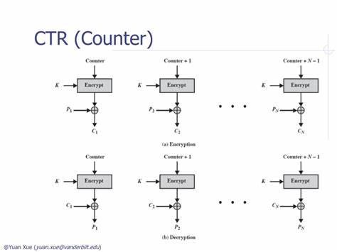
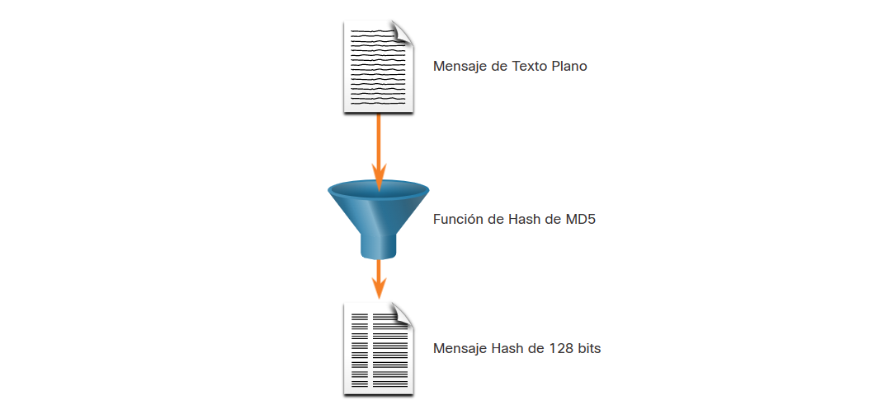

# 1. Seminario

- [1. Seminario](#1-seminario)
  - [1.1. Criptografía](#11-criptografía)
  - [1.2. Confidencialidad, Integridad y Disponibilidad](#12-confidencialidad-integridad-y-disponibilidad)
    - [1.2.1. Asegurando las comunicaciones](#121-asegurando-las-comunicaciones)
    - [1.2.2. Integridad de los datos](#122-integridad-de-los-datos)
    - [1.2.3. Cifrado por sustitución](#123-cifrado-por-sustitución)
    - [1.2.4. Cifrado por transposición](#124-cifrado-por-transposición)
    - [1.2.5. Rellenos de una sola vez](#125-rellenos-de-una-sola-vez)
    - [1.2.6. Principios criptográficos](#126-principios-criptográficos)
  - [1.3. Confidencialidad de los Datos](#13-confidencialidad-de-los-datos)
  - [1.4. Algoritmos de clave simétrica](#14-algoritmos-de-clave-simétrica)
    - [1.4.1. DES: Estándar de Encriptación de Datos](#141-des-estándar-de-encriptación-de-datos)
    - [1.4.2. 3DES (Triple DES)](#142-3des-triple-des)
    - [1.4.3. AES: Estándar de Encriptación Avanzada](#143-aes-estándar-de-encriptación-avanzada)
    - [1.4.4. Algoritmo de Cifrado Optimizado por Software (SEAL)](#144-algoritmo-de-cifrado-optimizado-por-software-seal)
    - [1.4.5. Cifrados Rivest (RC) algoritmos de la serie](#145-cifrados-rivest-rc-algoritmos-de-la-serie)
  - [1.5. Modos de sistema de cifrado](#15-modos-de-sistema-de-cifrado)
    - [1.5.1. Cripto-análisis](#151-cripto-análisis)
  - [1.6. Algoritmos de clave pública](#16-algoritmos-de-clave-pública)
    - [1.6.1. RSA: Rivest, Shamir, Adleman](#161-rsa-rivest-shamir-adleman)
    - [1.6.2. Otros algoritmos de clave pública](#162-otros-algoritmos-de-clave-pública)
      - [1.6.2.1. Diffie-Hellman](#1621-diffie-hellman)
  - [1.7. Firmas digitales](#17-firmas-digitales)
    - [1.7.1. Firmas de clave simétrica](#171-firmas-de-clave-simétrica)
    - [1.7.2. Firmas de clave pública](#172-firmas-de-clave-pública)
    - [1.7.3. Resúmenes de mensaje](#173-resúmenes-de-mensaje)
      - [1.7.3.1. Función de Hash](#1731-función-de-hash)
        - [1.7.3.1.1. MD5 con una síntesis de 128 bits](#17311-md5-con-una-síntesis-de-128-bits)
        - [1.7.3.1.2. Algoritmo de Hashing de SHA](#17312-algoritmo-de-hashing-de-sha)
        - [1.7.3.1.3. SHA-2](#17313-sha-2)
        - [1.7.3.1.4. Autenticación de Origen](#17314-autenticación-de-origen)
          - [1.7.3.1.4.1. Algoritmo de Hashing de HMAC](#173141-algoritmo-de-hashing-de-hmac)
          - [1.7.3.1.4.2. Creando un valor HMAC](#173142-creando-un-valor-hmac)
          - [1.7.3.1.4.3. Verificando un valor HMAC](#173143-verificando-un-valor-hmac)
          - [1.7.3.1.4.4. Ejemplo de HMAC en Cisco Router](#173144-ejemplo-de-hmac-en-cisco-router)
    - [1.7.4. Implementación práctica de firmas digitales en Nicaragua, México y España](#174-implementación-práctica-de-firmas-digitales-en-nicaragua-méxico-y-españa)

## 1.1. Criptografía

La palabra criptografía viene del griego y significa “escritura secreta”. Tiene una larga y colorida historia que se remonta a miles de años.

Los profesionales hacen una distinción entre un sistema de cifrado y un sistema de código. Un sistema de cifrado es una transformación carácter por carácter o bit por bit, sin importar la estructura lingüística del mensaje. En contraste, uno de código reemplaza una palabra con otra palabra o símbolo.

Históricamente, cuatro grupos han utilizado y contribuido al arte de la criptografía: los militares, el cuerpo diplomático, los redactores de los periódicos y los amantes. De éstos, la milicia ha tenido el papel más importante y ha moldeado el campo a través de los siglos.

Los mensajes a encriptar, conocidos como texto plano, se transforman mediante una función parametrizada por una clave. El resultado del proceso de encriptación, conocido como texto cifrado, se transmite a continuación, muchas veces por mensajero o radio. Suponemos que el enemigo, o intruso, escucha y copia con exactitud todo el texto cifrado. Sin embargo, a diferencia del destinatario original, el intruso no conoce la clave de des-encriptación y no puede descifrar con facilidad este texto.

El arte de quebrantar los sistemas de cifrado, es conocido como criptoanálisis, y en conjunto con el arte de idearlos (criptografía) se conocen como criptología.

Una regla fundamental de la criptografía es que se debe suponer que el criptoanalista conoce los métodos utilizados para encriptar y des-encriptar. En otras palabras, el criptoanalista sabe con detalle cómo funciona el método de encriptación.

Aquí es donde entra la clave. Ésta consiste en una cadena corta (relativamente) que selecciona uno de muchos encriptados potenciales. En contraste con el método general, que tal vez sólo se cambie cada cierto número de años, la clave se puede cambiar con la frecuencia requerida.

La idea de que el criptoanalista conozca los algoritmos y que la naturaleza secreta se base principalmente en las claves se conoce como Principio de Kerckhoff, que debe su nombre al criptógrafo militar holandés Auguste Kerckhoff, quien lo estableció por primera vez en 1883 (Kerckhoff, 1883). Por lo tanto, tenemos:

- Principio de Kerckhoff: Todos los algoritmos deben ser públicos; sólo las claves deben ser secretas.

## 1.2. Confidencialidad, Integridad y Disponibilidad

La seguridad de la red consiste en proteger la información y los sistemas de información del acceso, uso, divulgación, interrupción, modificación o destrucción no autorizados.

La mayoría de las organizaciones siguen la triada de seguridad de la información de la CIA:

- **Confidencialidad -** Solamente individuos, entidades o procesos autorizados pueden tener acceso a información confidencial. Puede requerir el uso de algoritmos de cifrado criptográfico como AES para cifrar y descifrar datos.
- **Integridad -** se refiere a proteger los datos de modificaciones no autorizadas. Requiere el uso de algoritmos de hashing criptográficos como SHA.
- **Disponibilidad -** Los usuarios autorizados deben tener acceso ininterrumpido a los recursos y datos importantes. Requiere implementar servicios redundantes, puertas de enlace y enlaces.

**La criptografía** es el estudio y la práctica de técnicas que se utilizan para asegurar la comunicación y proteger la información de accesos no autorizados o modificaciones no deseadas. Se basa en principios matemáticos y algoritmos para transformar datos en forma ilegible, llamados texto cifrado, que solo pueden ser interpretados por personas o sistemas autorizados que poseen la clave de descifrado adecuada.

### 1.2.1. Asegurando las comunicaciones

Las organizaciones deben proporcionar soporte para proteger los datos a medida que viajan a través de enlaces. Esto puede incluir el tráfico interno, pero la mayor preocupación es proteger los datos que viajan fuera de la organización a sitios de sucursales, teletrabajadores y partners.

Estos son los cuatro elementos de las comunicaciones seguras:

- **Integridad de los Datos -** Garantiza que el mensaje no se haya modificado. Se detecta cualquier cambio en los datos en tránsito. La integridad se garantiza mediante la aplicación de los algoritmos de generación de hash Message Digest versión 5 (MD5) o Secure Hash (SHA).
- **Autenticación de origen -** para garantizar que el mensaje no sea falso y que el remitente sea el verdadero. Muchas redes modernas garantizan la autenticación con protocolos, como el código de autenticación de mensaje hash (HMAC, Hash Message Authentication Code).
- **Confidencialidad de los datos -** garantiza que solamente los usuarios autorizados puedan leer el mensaje. Si se intercepta el mensaje, no se puede descifrar en un plazo razonable. La confidencialidad de los datos se implementa utilizando algoritmos de encriptación simétrica y asimétrica.
- **Imposibilidad de negación de los datos -** garantiza que el remitente no pueda negar ni refutar la validez de un mensaje enviado. La imposibilidad de negación se basa en el hecho de que solamente el remitente tiene características o una firma únicas relacionadas con el tratamiento del mensaje.

La criptografía puede usarse casi en cualquier lugar donde haya comunicación de datos. De hecho, estamos yendo hacia un mundo donde toda la comunicación se encriptará.

### 1.2.2. Integridad de los datos

Las funciones de hash se utilizan para garantizar la integridad de un mensaje. Garantizan que los datos del mensaje no hayan cambiado accidental o intencionalmente.

En la figura 1, el remitente envía una transferencia de USD $100 a Alex.

El algoritmo hash funciona de la siguiente manera:

1. El dispositivo de envío ingresa el mensaje en un algoritmo hash y calcula su hash de longitud fija de **4ehiD×67NMop9**.
2. Luego, este hash se adjunta al mensaje y se envía al receptor. El mensaje y el hash se transmiten en texto sin formato.
3. El dispositivo receptor elimina el hash del mensaje e introduce el mensaje en el mismo algoritmo de hash. Si el hash calculado es igual al que se adjunta al mensaje, significa que el mensaje no se modificó durante su recorrido. Si los hash son no iguales, como se ve en la figura, ya no es posible garantizar la integridad del mensaje.

### 1.2.3. Cifrado por sustitución

El cifrado por sustitución es una técnica criptográfica en la cual cada símbolo o carácter del mensaje original es reemplazado por otro símbolo o carácter de acuerdo con una regla establecida. El objetivo de este cifrado es ocultar el significado del mensaje original y dificultar su comprensión por parte de personas no autorizadas.

Existen diferentes tipos de cifrado por sustitución, pero uno de los más conocidos es el cifrado César. En este cifrado, cada letra del alfabeto es desplazada un número fijo de posiciones hacia la derecha. Por ejemplo, si el desplazamiento es de 3 posiciones, la letra "A" se cifrará como "D", la "B" como "E", y así sucesivamente. Al aplicar el cifrado César al mensaje, todas las letras se reemplazan por letras diferentes en función del desplazamiento establecido. El sistema general de sustitución de símbolo por símbolo se llama sistema de cifrado por sustitución
mono-alfabética.

El cifrado por sustitución también puede involucrar la sustitución de símbolos no alfabéticos, como números o caracteres especiales. En estos casos, se utiliza una tabla de sustitución que relaciona cada símbolo del mensaje original con su símbolo correspondiente en el texto cifrado.

A pesar de su simplicidad, el cifrado por sustitución tiene ciertas debilidades. Por ejemplo, si se conoce el idioma en el que se ha escrito el mensaje original y se identifica el patrón de frecuencia de las letras, es posible realizar análisis de frecuencia para descifrar el mensaje. Además, como solo se reemplaza cada símbolo por otro, es posible realizar ataques de fuerza bruta o probar todas las posibles combinaciones hasta encontrar la correcta.

A medida que la criptografía ha evolucionado, han surgido técnicas más sofisticadas que han superado las debilidades del cifrado por sustitución. Sin embargo, comprender los conceptos básicos del cifrado por sustitución es fundamental para apreciar la evolución y comprender las técnicas criptográficas más avanzadas.

### 1.2.4. Cifrado por transposición

Los sistemas de cifrado por transposición son una clase de técnicas criptográficas que se basan en reorganizar el orden de los caracteres en un mensaje sin alterar los caracteres en sí. En lugar de reemplazar los caracteres, como en el cifrado por sustitución, en el cifrado por transposición se cambia el orden de los caracteres para ocultar el mensaje original.

Existen diferentes métodos de cifrado por transposición, cada uno con su propia forma de reorganizar el texto. Algunos ejemplos comunes de sistemas de cifrado por transposición son:

- Cifrado de columna: En este método, se escribe el mensaje original en filas y se leen las columnas en un orden específico, siguiendo una clave o patrón predefinido. El mensaje cifrado se obtiene al leer los caracteres de cada columna en el orden indicado por la clave.

- Cifrado de ruta: También conocido como cifrado de la serpiente, este método organiza el mensaje en una matriz rectangular y luego se lee en un patrón específico. Por ejemplo, se puede leer en forma de zigzag de izquierda a derecha y de arriba abajo. El mensaje cifrado se obtiene al leer los caracteres según el patrón establecido.

- Cifrado de permutación: Este método implica reorganizar los caracteres del mensaje original según una clave específica. La clave determina el orden en el que se deben colocar los caracteres para formar el mensaje cifrado.

Al igual que con el cifrado por sustitución, los sistemas de cifrado por transposición también tienen vulnerabilidades. Por ejemplo, si el tamaño de la matriz o la clave de permutación son conocidos, es posible realizar ataques de criptoanálisis para descifrar el mensaje.

Es importante destacar que los sistemas de cifrado por transposición a menudo se combinan con sistemas de cifrado por sustitución para aumentar la seguridad y la complejidad del cifrado. Estas técnicas de cifrado se utilizan tanto en la historia antigua de la criptografía como en los sistemas modernos, ya sea de forma independiente o en combinación con otros métodos criptográficos.

### 1.2.5. Rellenos de una sola vez

Los rellenos de una sola vez, también conocidos como rellenos de clave única, son técnicas utilizadas en criptografía para asegurar la confidencialidad e integridad de los mensajes transmitidos. Estos rellenos se aplican en combinación con algoritmos de cifrado para proteger los datos de manera más efectiva.

Cuando se utilizan algoritmos de cifrado en modo bloque, es decir, que operan en bloques de datos fijos, puede surgir un problema cuando el tamaño del mensaje no es un múltiplo exacto del tamaño del bloque. En tales casos, se utiliza un relleno para completar el último bloque de datos y permitir que el algoritmo de cifrado funcione correctamente.

Los rellenos de una sola vez se denominan así porque se generan de manera aleatoria y no se repiten para cada mensaje. Cada vez que se cifra un mensaje, se genera un relleno único para ese mensaje en particular. Esto ayuda a evitar patrones repetitivos y aumenta la seguridad del cifrado.

Un ejemplo común de relleno de una sola vez es el relleno PKCS #5/7 (Public Key Cryptography Standards). Este relleno agrega bytes adicionales al bloque de datos de manera que se complete el tamaño del bloque requerido. Los bytes adicionales contienen información sobre la cantidad de relleno agregado, lo que permite eliminar el relleno de manera adecuada durante el proceso de descifrado.

Los rellenos de una sola vez, a pesar de su concepto teóricamente sólido, presentan algunas desventajas en la práctica.

1. Tamaño variable de los mensajes: Los rellenos de una sola vez están diseñados para trabajar con algoritmos de cifrado en modo bloque, lo que significa que se deben completar bloques de datos de tamaño fijo. Sin embargo, en situaciones donde los mensajes tienen longitudes variables, los rellenos de una sola vez pueden generar un aumento significativo en el tamaño del mensaje cifrado, lo que puede ser ineficiente en términos de almacenamiento y transmisión.
2. Requerimiento de sincronización: Los rellenos de una sola vez requieren que el receptor del mensaje conozca la cantidad y ubicación del relleno agregado. Esto implica la necesidad de una comunicación adicional o un mecanismo de sincronización entre el remitente y el receptor para garantizar que el relleno se maneje correctamente durante el proceso de descifrado. Si la sincronización no se realiza de manera adecuada, puede haber errores en el descifrado o pérdida de integridad de los datos.

Los rellenos de una sola vez son importantes para garantizar que los algoritmos de cifrado funcionen correctamente y proporcionen la seguridad necesaria. Sin ellos, los mensajes de longitud no uniforme podrían generar errores o exponer información sensible. Al aplicar rellenos de una sola vez, se logra que los mensajes se ajusten al tamaño requerido por el algoritmo de cifrado, asegurando así una protección adecuada de los datos transmitidos.

### 1.2.6. Principios criptográficos

Los principios criptográficos fundamentales son conceptos esenciales en la criptografía que buscan garantizar la seguridad y confidencialidad de la información. Dos de estos principios son la redundancia y la actualización.

- **Redundancia:** Este principio establece que se deben incorporar elementos redundantes en los sistemas criptográficos para mejorar su resistencia ante posibles ataques y fallos. La redundancia implica la inclusión de información adicional o repetida que permite detectar y corregir errores, así como evitar la pérdida de datos en caso de fallas.

  - **Paridad en bits:** En la transmisión de datos, se puede agregar un bit adicional de paridad que indica si el número de unos en un conjunto de bits es par o impar. Esto ayuda a detectar errores en la transmisión de datos.
  - **Ruido aleatorio:** En sistemas criptográficos, se puede introducir ruido aleatorio en los datos para dificultar el análisis y el descifrado. Esto se utiliza, por ejemplo, en la técnica de difusión en los cifrados de flujo, donde se mezcla el mensaje con una secuencia de bits aleatorios.

- **Actualización:** El segundo principio criptográfico es que se deben tomar medidas para asegurar que cada mensaje recibido se verifique para determinar si está actualizado, es decir, que se haya enviado recientemente. Este principio es crucial para evitar ataques de repetición, donde un intruso reproduce mensajes antiguos con fines maliciosos.

  - **Marcas de tiempo:** Cada mensaje incluye una marca de tiempo que indica su momento de generación y tiene una validez limitada. El receptor verifica la marca de tiempo del mensaje recibido y descarta aquellos que superen el límite establecido. Esto garantiza que solo los mensajes recientes y legítimos sean considerados y ayuda a prevenir la reproducción de mensajes antiguos por parte de un atacante.

Es importante tener en cuenta que estos principios criptográficos se aplican en conjunto con otras técnicas y medidas de seguridad para crear sistemas criptográficos robustos y confiables. La combinación de redundancia y actualización, junto con otros principios y algoritmos criptográficos, contribuye a fortalecer la seguridad de la información y protegerla de posibles amenazas.

## 1.3. Confidencialidad de los Datos

Hay dos clases de encriptación utilizadas para brindar confidencialidad de los datos. Estas dos clases se diferencian en cómo utilizan las claves.

Los algoritmos de cifrado simétricos como (DES), 3DES y el Estándar de cifrado avanzado (AES) se basan en la premisa de que cada parte que se comunica conoce la clave pre-compartida. La confidencialidad de los datos también se puede garantizar utilizando algoritmos asimétricos, incluidos Rivest, Shamir y Adleman (RSA) y la infraestructura de clave pública (PKI).

En la figura, se ponen de relieve algunas diferencias entre cada método de algoritmo de encriptación.

## 1.4. Algoritmos de clave simétrica

Los algoritmos simétricos utilizan la misma clave pre-compartida para encriptar y desencriptar datos. Antes de que ocurra cualquier comunicación encriptada, el emisor y el receptor conocen la clave pre-compartida, también llamada clave secreta.

Para ayudar a ejemplificar cómo funciona la encriptación simétrica, consideremos un ejemplo en el que Alice y Bob viven en diferentes lugares y quieren intercambiar mensajes secretos entre sí mediante el sistema de correo. En este ejemplo, Alice desea enviar un mensaje secreto a Bob.

En la figura, se ve que Alice y Bob tienen claves idénticas para un único candado. Intercambiaron estas claves antes de enviar cualquier mensaje secreto. Alice escribe un mensaje privado y lo coloca en una caja pequeña que cierra con el candado y su clave. Le envía la caja a Bob. El mensaje está seguro dentro de la caja mientras esta recorre el camino del sistema de oficina postal. Cuando Bob recibe la caja, usa la clave para abrir el candado y recuperar el mensaje. Bob puede utilizar la misma caja y el mismo candado para enviar una respuesta secreta a Alice.

Hoy en día, los algoritmos de encriptación simétrica suelen utilizarse con el tráfico de VPN. Esto se debe a que los algoritmos simétricos utilizan menos recursos de CPU que los algoritmos de encriptación asimétrica. El cifrado y descifrado de datos es rápido cuando se usa una VPN. Al utilizar algoritmos de encriptación simétrica, como ocurre con cualquier otro tipo de encriptación, mientras más prolongada sea la clave, más tiempo demorará alguien en descubrirla. La mayoría de las claves de encriptación tienen entre 112 bits y 256 bits. Para garantizar que la encriptación sea segura, se recomienda una longitud mínima de clave de 128 bits. Para comunicaciones más seguras, se aconseja el uso de claves más prolongadas.

Los algoritmos de cifrado simétrico bien conocidos se describen en la tabla.

### 1.4.1. DES: Estándar de Encriptación de Datos

DES (Data Encryption Standard) es un estándar de encriptación de datos que fue desarrollado en la década de 1970 por IBM en colaboración con la Agencia de Seguridad Nacional (NSA) de Estados Unidos. Fue ampliamente utilizado como algoritmo de cifrado simétrico para proteger la confidencialidad de la información en diversas aplicaciones y sistemas.

El objetivo principal de DES era proporcionar un alto nivel de seguridad en la encriptación de datos. Utiliza un enfoque de cifrado de bloque, lo que significa que procesa los datos en bloques fijos de un tamaño específico. En el caso de DES, cada bloque de datos es de 64 bits.

El algoritmo de cifrado DES utiliza una clave de 56 bits para encriptar y desencriptar los datos. Sin embargo, debido a la creciente capacidad de cómputo y la posibilidad de ataques de fuerza bruta, se consideró que una clave de 56 bits era insuficiente para mantener la seguridad a largo plazo.

Como resultado, el uso de DES ha disminuido en los últimos años y ha sido reemplazado por algoritmos de cifrado más fuertes, como AES (Advanced Encryption Standard). AES ofrece una mayor longitud de clave y mejores características de seguridad en comparación con DES.

Aunque DES ya no es ampliamente utilizado para la encriptación de datos en aplicaciones modernas, su legado continúa y ha sentado las bases para el desarrollo de algoritmos criptográficos más avanzados. Además, DES sigue siendo relevante en algunos sistemas heredados y se ha utilizado como punto de referencia para evaluar el rendimiento de otros algoritmos de cifrado.

### 1.4.2. 3DES (Triple DES)

3DES (Triple Data Encryption Standard) es un algoritmo de encriptación que se basa en el estándar DES (Data Encryption Standard). Fue desarrollado como una mejora de seguridad para el DES original, que se consideraba vulnerable a los avances en la capacidad de cómputo.

A diferencia de DES, que utiliza una clave de 56 bits, 3DES utiliza una combinación de tres claves distintas de 56 bits cada una, lo que resulta en una clave total de 168 bits. El proceso de encriptación en 3DES consiste en aplicar tres veces el algoritmo DES en secuencia: primero con una clave, luego con otra clave y finalmente con la última clave. Esto proporciona una mayor seguridad, ya que se ejecutan tres rondas de encriptación.

La ventaja de 3DES radica en su resistencia a los ataques de fuerza bruta, ya que el número de posibles combinaciones de claves es mucho mayor que en DES. Además, al utilizar tres claves diferentes, se agrega una capa adicional de seguridad.

Sin embargo, a medida que la criptografía avanzó, se desarrollaron algoritmos más eficientes y seguros, como AES. Aunque 3DES sigue siendo utilizado en algunos sistemas heredados y aplicaciones específicas, su uso se ha ido reduciendo debido a su velocidad relativamente lenta en comparación con algoritmos más modernos.

Es importante destacar que, si bien 3DES proporciona una mayor seguridad en comparación con DES, su diseño y rendimiento lo hacen menos óptimo que otros algoritmos más nuevos y eficientes. Por esta razón, se recomienda utilizar algoritmos criptográficos más modernos, como AES, para garantizar un mayor nivel de seguridad en las aplicaciones y sistemas actuales.

### 1.4.3. AES: Estándar de Encriptación Avanzada

AES (Advanced Encryption Standard) es un estándar de encriptación avanzada ampliamente utilizado en todo el mundo para proteger la confidencialidad de la información. Fue seleccionado por el Instituto Nacional de Estándares y Tecnología (NIST) de Estados Unidos en 2001 como el algoritmo de cifrado simétrico recomendado para reemplazar al DES (Data Encryption Standard).

El objetivo principal de AES es proporcionar un alto nivel de seguridad y eficiencia en la encriptación de datos. Utiliza un enfoque de cifrado de bloque, similar a DES, donde los datos se procesan en bloques fijos de tamaño específico. En el caso de AES, los bloques de datos son de 128 bits.

Una de las principales ventajas de AES es su flexibilidad en cuanto a la longitud de clave. Puede admitir claves de 128, 192 y 256 bits, lo que proporciona diferentes niveles de seguridad. La longitud de clave más larga, AES-256, se considera extremadamente resistente a los ataques criptográficos y es ampliamente utilizada en aplicaciones sensibles.

El algoritmo AES opera mediante una serie de rondas de transformaciones criptográficas, que incluyen sustituciones no lineales, permutaciones y mezclas de los datos. Estas operaciones se realizan de manera iterativa para proporcionar una mayor robustez y confidencialidad en la encriptación.

AES ha demostrado ser un estándar confiable y seguro en la criptografía moderna. Es ampliamente utilizado en aplicaciones que requieren una protección sólida de la información, como comunicaciones seguras, sistemas de almacenamiento en la nube, transacciones electrónicas y protección de datos confidenciales.

Su amplia adopción y su resistencia a los ataques criptográficos han llevado a AES a convertirse en uno de los algoritmos de encriptación más utilizados en todo el mundo, proporcionando una sólida seguridad y confidencialidad en numerosas aplicaciones y entornos.

### 1.4.4. Algoritmo de Cifrado Optimizado por Software (SEAL)

El algoritmo de cifrado optimizado por software (SEAL) es un algoritmo de cifrado simétrico rápido y alternativo a DES, 3DES y AES. Fue diseñado específicamente para tener un impacto menor en la CPU en comparación con otros algoritmos basados en software.

SEAL utiliza una clave de cifrado de 160 bits, lo que proporciona un nivel de seguridad adecuado para la mayoría de las aplicaciones. Aunque su clave es más corta que la utilizada en AES (128, 192 o 256 bits), la implementación eficiente de SEAL permite un cifrado rápido y seguro.

La ventaja principal de SEAL es su capacidad para proporcionar una alternativa eficiente y de menor impacto en la CPU en comparación con DES, 3DES y AES. Esto es especialmente útil en entornos donde los recursos de la CPU son limitados o cuando se requiere un cifrado rápido en sistemas con restricciones de rendimiento.

Es importante destacar que SEAL es un algoritmo de cifrado propietario y no tan ampliamente conocido o utilizado como DES, 3DES o AES. Aunque puede ofrecer ventajas en términos de rendimiento, es fundamental realizar una evaluación de seguridad adecuada y considerar el contexto específico de uso antes de implementarlo en un sistema.

### 1.4.5. Cifrados Rivest (RC) algoritmos de la serie

La serie de algoritmos de cifrado Rivest (RC) hace referencia a una familia de cifrados desarrollados por el renombrado criptógrafo Ronald Rivest. Estos algoritmos son ampliamente utilizados en la criptografía y se conocen por su seguridad y eficiencia. A continuación, mencionaré algunos de los algoritmos de la serie RC más conocidos:

1. **RC2:** Es un algoritmo de cifrado de bloque que utiliza una clave variable de longitud y soporta tamaños de bloque de 8 bytes. Fue diseñado para ser eficiente en software y hardware, y se ha utilizado en una amplia gama de aplicaciones.
2. **RC4:** Es un algoritmo de flujo ampliamente conocido y utilizado. Aunque no es un cifrado de bloque, sino un generador de secuencias pseudo-aleatorias, se ha utilizado comúnmente en aplicaciones de cifrado y protocolos de seguridad, como WEP (Wired Equivalent Privacy) en redes inalámbricas.
3. **RC5:** Es un algoritmo de cifrado de bloque que utiliza una estructura de clave variable y permite un tamaño de bloque variable. Es conocido por su flexibilidad en términos de tamaño de clave y tamaño de bloque, lo que lo hace adecuado para diversas aplicaciones.
4. **RC6:** Es una mejora del algoritmo RC5 que utiliza una estructura de clave variable y un tamaño de bloque fijo de 128 bits. Fue diseñado para ser seguro y eficiente en diferentes plataformas.

Estos son solo algunos ejemplos de los algoritmos de la serie RC desarrollados por Ronald Rivest. Cada uno de ellos tiene características y propiedades únicas, pero todos comparten la reputación de ser algoritmos criptográficos sólidos y confiables.

## 1.5. Modos de sistema de cifrado

Los modos de cifrado son técnicas que se utilizan en criptografía para aplicar algoritmos de cifrado de manera eficiente y segura. Estos modos permiten utilizar los algoritmos de cifrado en diferentes escenarios y adaptarlos a las necesidades específicas de cada aplicación. A continuación, se presentan algunos modos de cifrado comunes:

- **ECB (Electronic Codebook)**: Este modo de cifrado divide los datos en bloques de tamaño fijo y cada bloque se cifra de forma independiente utilizando la misma clave. Es el modo más simple, pero puede presentar vulnerabilidades cuando se cifran datos con patrones repetitivos.

- **CBC (Cipher Block Chaining)**: En este modo, cada bloque de datos se cifra combinándolo con el bloque cifrado anterior. Se utiliza un vector de inicialización (IV) para el primer bloque y luego se aplica la operación XOR entre el bloque de datos y el bloque cifrado anterior antes de cifrarlo. El CBC proporciona mayor seguridad que el modo ECB al introducir una dependencia entre los bloques cifrados.

- **CFB (Cipher Feedback)**: En este modo, se utiliza el cifrado de retroalimentación para cifrar los bloques de datos. En lugar de cifrar los datos directamente, se cifra un flujo de retroalimentación generado por los bloques cifrados anteriores. Esto permite cifrar bloques individuales de datos en lugar de depender de bloques anteriores.

- **OFB (Output Feedback)**: En este modo, se utiliza la salida del cifrado como retroalimentación para generar un flujo de bits que se combina mediante una operación XOR con los datos de entrada para producir el texto cifrado. OFB convierte un algoritmo de cifrado de bloque en un cifrado de flujo, donde se pueden cifrar y descifrar datos individualmente.

- **CTR (Counter)**: En este modo, se utiliza un contador como entrada para el cifrado de bloque. El contador se combina con una clave para generar una secuencia de valores pseudoaleatorios, que luego se combinan con los datos de entrada mediante una operación XOR para producir el texto cifrado. CTR también convierte un algoritmo de cifrado de bloque en un cifrado de flujo.

Estos son solo algunos ejemplos de modos de cifrado utilizados en criptografía. Cada modo tiene sus propias características y aplicaciones recomendadas. Es importante seleccionar el modo adecuado según los requisitos de seguridad y las características de la aplicación en la que se utilice el cifrado.

### 1.5.1. Cripto-análisis

El criptoanálisis es el estudio de técnicas y métodos utilizados para romper o debilitar sistemas de cifrado. A continuación, se mencionan cuatro avances importantes en criptoanálisis:

1. **Criptoanálisis diferencial**: Esta técnica, desarrollada por Biham y Shamir en 1997, se utiliza para atacar sistemas de cifrado en bloques. Consiste en analizar el comportamiento de la encriptación al observar cómo varían los bloques de texto plano en cada iteración interna. Al identificar patrones comunes y probabilísticos, es posible realizar ataques y descubrir información sensible.

2. **Criptoanálisis lineal**: Desarrollado por Matsui en 1994, este método permite descifrar el algoritmo DES con un número reducido de textos planos conocidos. Se basa en aplicar la operación OR exclusivo a bits específicos del texto plano y el texto cifrado, y luego analizar el resultado. Al explotar desviaciones sutiles introducidas por los sistemas de cifrado, es posible reducir la complejidad del ataque.

3. **Análisis del consumo de energía eléctrica**: Este enfoque implica utilizar la medición del consumo de energía eléctrica de una computadora durante la ejecución de un algoritmo criptográfico para obtener información sobre las claves secretas. Al observar las fluctuaciones en el consumo de energía, se pueden deducir las claves utilizadas en el proceso. Para resistir este tipo de ataque, es necesario diseñar algoritmos que sean insensibles al consumo de energía.

4. **Análisis de temporización**: Los algoritmos criptográficos contienen instrucciones condicionales (if) que prueban bits en las claves de ronda. El análisis de temporización se basa en medir los tiempos de ejecución de diferentes pasos del algoritmo al reducir la velocidad del reloj. Al analizar estos tiempos, es posible deducir las claves de ronda y, posteriormente, calcular la clave original. La combinación de análisis de energía y temporización puede aumentar la efectividad de este tipo de ataques.

Estos avances en criptoanálisis demuestran la importancia de diseñar sistemas de cifrado robustos y resistentes a diversos tipos de ataques. La criptografía continúa evolucionando para contrarrestar estos avances y mantener la seguridad de la información.

## 1.6. Algoritmos de clave pública

Los algoritmos asimétricos, también llamados algoritmos de claves públicas, están diseñados para que la clave de encriptación y la de desencriptación sean diferentes, como se ve en la figura 1. En cualquier plazo razonable, no es posible calcular la clave de desencriptación a partir de la clave de encriptación, y viceversa.

Los algoritmos asimétricos utilizan una clave pública y una privada. Ambas claves son capaces de encriptar, pero se requiere la clave complementaria para la desencriptación. El proceso también es reversible. Los datos encriptados con la clave privada requieren la clave pública para desencriptarse. Los algoritmos asimétricos logran confidencialidad, autenticación e integridad mediante el uso de este proceso.

Debido a que ninguno de los participantes comparte un secreto, deben usarse longitudes de clave muy prolongadas. La encriptación asimétrica puede utilizar longitudes de claves entre 512 y 4,096 bits. Se confía en longitudes de clave superiores o equivalentes a 1024 bits, y las claves más cortas no se consideran fiables.

Entre algunos de los ejemplos de protocolos en los que se utilizan algoritmos de claves asimétricos se incluyen los siguientes:

- **Intercambio de claves por Internet (IKE, Internet Key Exchange) -** es un componente fundamental de las VPN con IPsec.
- **Secure Socket Layer (SSL) -** ahora se implementa como Seguridad de la capa de transporte (TLS) estándar de IETF.
- **Secure Shell (SSH) -** este protocolo proporciona una conexión segura de acceso remoto a dispositivos de red.
- **Pretty Good Privacy (PGP) -** este programa de computadora proporciona privacidad y autenticación criptográfica. A menudo, se utiliza para aumentar la seguridad de las comunicaciones por correo electrónico.

Los algoritmos asimétricos son sustancialmente más lentos que los simétricos. Su diseño se basa en problemas informáticos, como la factorización de números demasiado grandes o el cálculo de logaritmos discretos de números demasiado grandes.

Dado que carecen de velocidad, los algoritmos asimétricos se utilizan típicamente en criptografías de poco volumen, como las firmas digitales y el intercambio de claves. Sin embargo, la administración de claves de algoritmos asimétricos tiende a ser más simple que la de algoritmos simétricos porque, generalmente, es posible hacer pública una de las dos claves de encriptación o desencriptación.

En la tabla de la figura 2, se incluyen ejemplos comunes de algoritmo de encriptación asimétrica.

### 1.6.1. RSA: Rivest, Shamir, Adleman

RSA (Rivest-Shamir-Adleman) es un algoritmo de clave pública ampliamente utilizado en criptografía. Fue inventado en 1977 por Ron Rivest, Adi Shamir y Leonard Adleman, y se basa en la dificultad de factorizar números grandes en primos.

El algoritmo RSA utiliza dos claves matemáticamente relacionadas: una clave pública para encriptar los datos y una clave privada para desencriptarlos. La clave pública se puede compartir libremente con otros usuarios, mientras que la clave privada debe mantenerse en secreto. La seguridad del algoritmo se basa en la dificultad de factorizar el producto de dos números primos grandes para recuperar las claves privadas.

El proceso de encriptación con RSA implica tomar el mensaje original y elevarlo a una potencia utilizando la clave pública. El mensaje encriptado resultante solo puede ser desencriptado utilizando la clave privada correspondiente.

El uso más común de RSA es la encriptación de comunicaciones y la firma digital. En la encriptación de comunicaciones, la clave pública se utiliza para encriptar los datos que solo pueden ser desencriptados por el receptor que posee la clave privada. En la firma digital, se utiliza la clave privada para generar una firma única que permite verificar la autenticidad e integridad del mensaje.

Una de las ventajas de RSA es su seguridad basada en la dificultad de factorización de números grandes. Sin embargo, su rendimiento computacional puede ser más lento en comparación con otros algoritmos de clave pública más modernos, especialmente para operaciones con claves más largas.

En general, RSA ha sido ampliamente utilizado y estudiado durante décadas y sigue siendo un algoritmo de clave pública fundamental en la criptografía moderna.

[Píldora formativa 39: ¿Cómo funciona el algoritmo RSA?](https://www.youtube.com/watch?v=CMe0COxZxb0)

### 1.6.2. Otros algoritmos de clave pública

#### 1.6.2.1. Diffie-Hellman

Diffie-Hellman (DH) es un algoritmo matemático asimétrico que permite que dos computadoras generen una clave secreta idéntica compartida sin antes haberse comunicado. El emisor y el receptor nunca intercambian realmente la nueva clave compartida. Sin embargo, dado que ambos participantes la conocen, un algoritmo de encriptación puede utilizarla para encriptar el tráfico entre los dos sistemas.

Estos son tres ejemplos de casos en los que el algoritmo de DH suele utilizarse:

- Se intercambian datos mediante una VPN con IPsec
- Se encriptan datos en Internet usando SSL o TLS
- Se intercambian datos de SSH

Para ayudar a ejemplificar cómo funciona el algoritmo de DH, consulte la figura.

Los colores en la figura se utilizarán en lugar de números largos y complejos para simplificar el proceso de acuerdo de claves del algoritmo de DH. El intercambio de claves del algoritmo de DH comienza con Alice y Bob eligiendo arbitrariamente un color en común que no deben mantener en secreto. El color acordado en nuestro ejemplo es el amarillo.

Luego, Alice y Bob seleccionan un color secreto cada uno. Alice eligió rojo y Bob, azul. Nunca compartirán estos colores secretos con nadie. El color secreto representa la clave privada secreta que cada participante eligió.

Ahora, Alice y Bob mezclan el color común compartido (amarillo) con su color secreto respectivo para generar un color privado. Por lo tanto, Alice mezcla el amarillo con el rojo para obtener el anaranjado como color privado. Bob mezcla el amarillo y el azul para obtener verde como color privado.

Alice envía su color privado (anaranjado) a Bob y Bob le envía el suyo (verde) a Alice.

Alice y Bob mezclan cada uno el color que recibieron con su propio color secreto original (rojo para Alice y azul para Bob). El resultado es una mezcla final de color marrón que es idéntica a la mezcla final del otro participante. El color marrón representa la clave secreta que comparten Bob y Alice.

La seguridad de DH utiliza números increíblemente grandes en sus cálculos. Por ejemplo, un número del algoritmo de DH de 1024 bits es aproximadamente igual a un número decimal de 309 dígitos. Considerando que mil millones tienen 10 dígitos decimales (1 000 000 000), es posible imaginar fácilmente la complejidad de trabajar no con uno, sino con varios números decimales de 309 dígitos.

Desafortunadamente, los sistemas de clave asimétrica son extremadamente lentos para cualquier tipo de encriptación masiva. Por esto, es común encriptar la mayor parte del tráfico utilizando un algoritmo simétrico (como 3DES o AES) y dejar el algoritmo de DH para crear claves que serán utilizadas por el algoritmo de encriptación.

## 1.7. Firmas digitales

Las firmas digitales son un componente importante de la criptografía de clave pública y se utilizan para garantizar la autenticidad, integridad y no repudio de los datos electrónicos. Una firma digital es un esquema criptográfico que permite a un remitente probar de manera convincente su identidad y asegurar que el contenido del mensaje no ha sido modificado desde que se firmó.

El proceso de firmar digitalmente un mensaje implica el uso de una función de resumen criptográfico, también conocida como función hash, para calcular un resumen único del contenido del mensaje. A continuación, se utiliza la clave privada del remitente para cifrar el resumen, creando así la firma digital. La firma digital se adjunta al mensaje y se envía junto con él.

Cuando el receptor recibe el mensaje y la firma digital, puede utilizar la clave pública correspondiente al remitente para descifrar la firma digital y obtener el resumen del mensaje original. Luego, el receptor calcula nuevamente el resumen del mensaje recibido utilizando la misma función hash y compara los dos resúmenes. Si los resúmenes coinciden, esto garantiza que el mensaje no ha sido alterado y que proviene del remitente legítimo.

Las firmas digitales ofrecen varios beneficios clave, incluyendo:

1. **Autenticación:** La firma digital permite verificar la identidad del remitente, asegurando que proviene de la entidad que dice ser.
2. **Integridad:** La firma digital garantiza que el contenido del mensaje no ha sido alterado en tránsito.
3. **No repudio:** La firma digital proporciona una prueba irrefutable de que el remitente envió el mensaje, lo que evita que el remitente niegue su participación en el envío.
4. **Seguridad:** La seguridad de las firmas digitales se basa en la dificultad computacional de falsificar o generar una firma válida sin acceso a la clave privada correspondiente.

Las firmas digitales se utilizan en una amplia gama de aplicaciones, como transacciones financieras en línea, contratos electrónicos, comunicaciones seguras y verificación de software. Algoritmos criptográficos como RSA y ECC (Elliptic Curve Cryptography) son comúnmente utilizados para implementar firmas digitales en sistemas de seguridad modernos.

### 1.7.1. Firmas de clave simétrica

Las firmas digitales están asociadas principalmente con algoritmos de clave pública, ya que se basan en la utilización de pares de claves pública-privada. En la criptografía de clave simétrica, el enfoque es diferente y no se utilizan firmas digitales en el sentido tradicional.

En la criptografía de clave simétrica, se utiliza una única clave compartida entre el remitente y el receptor para cifrar y descifrar los mensajes. No se emplean pares de claves pública-privada como en la criptografía de clave pública.

Sin embargo, en el contexto de la criptografía de clave simétrica, es posible utilizar técnicas de autenticación de mensajes para verificar la integridad de los mismos. Estas técnicas no son exactamente firmas digitales, pero cumplen una función similar al permitir que el receptor verifique la autenticidad del mensaje recibido.

Por ejemplo, se puede utilizar un código de autenticación de mensajes (MAC, por sus siglas en inglés) para generar un valor que se adjunta al mensaje y que se calcula utilizando una función criptográfica y la clave compartida entre el remitente y el receptor. El receptor puede entonces verificar la integridad del mensaje al calcular nuevamente el MAC utilizando la misma función criptográfica y la clave compartida, y comparar el resultado con el valor recibido.

El uso de firmas digitales en el contexto de la criptografía de clave simétrica es menos común debido a las limitaciones inherentes a la naturaleza de este tipo de cifrado. Sin embargo, las técnicas de autenticación de mensajes, como los códigos de autenticación de mensajes, son ampliamente utilizadas para garantizar la integridad de los mensajes transmitidos en sistemas de clave simétrica.

### 1.7.2. Firmas de clave pública

Las firmas digitales de clave pública son una técnica criptográfica utilizada para garantizar la autenticidad, integridad y no repudio de un mensaje utilizando pares de claves pública-privada. El proceso de firma digital implica el uso de la clave privada del remitente para firmar el mensaje, y luego el receptor puede verificar la firma utilizando la clave pública correspondiente.

El algoritmo de firma digital más comúnmente utilizado es RSA (Rivest-Shamir-Adleman). A continuación, se presenta un resumen del proceso general de firma digital utilizando RSA:

1. **Generación de claves:** El remitente genera un par de claves RSA: una clave privada que se mantiene en secreto y una clave pública que se comparte con los demás.
2. **Firma del mensaje:** El remitente utiliza su clave privada para aplicar una función de hash criptográfica al mensaje y luego cifra el hash resultante con su clave privada. Esto crea la firma digital del mensaje.
3. **Envío del mensaje y la firma:** El remitente envía el mensaje junto con la firma digital adjunta al receptor.
4. **Verificación de la firma:** El receptor utiliza la clave pública del remitente para descifrar la firma digital y obtener el hash del mensaje original. Luego, el receptor aplica la misma función de hash criptográfica al mensaje recibido y compara el hash calculado con el obtenido de la firma.

Si el hash calculado y el hash obtenido de la firma coinciden, esto significa que el mensaje no ha sido alterado y que la firma es válida. Además, como solo el remitente posee la clave privada correspondiente, se puede afirmar que el mensaje proviene del remitente auténtico.

Las firmas digitales de clave pública son ampliamente utilizadas en aplicaciones como la autenticación de correos electrónicos, la verificación de identidad en transacciones en línea y la garantía de la integridad de los documentos digitales. Proporcionan una forma segura de verificar la autoría y la integridad de los mensajes sin necesidad de compartir claves privadas.

### 1.7.3. Resúmenes de mensaje

Los resúmenes de mensaje, también conocidos como funciones de hash, son algoritmos que toman un mensaje de entrada y producen una cadena de bits de longitud fija, conocida como el resumen de mensaje o el hash. Estas funciones tienen varias propiedades importantes:

1. **Facilidad de cálculo**: Es rápido y eficiente calcular el resumen de mensaje de un texto plano dado utilizando la función de hash. El proceso es computacionalmente eficiente y no requiere mucho tiempo ni recursos.
2. **Unidireccionalidad**: Es extremadamente difícil, computacionalmente hablando, encontrar el mensaje original a partir del resumen de mensaje. Dado un resumen de mensaje, es prácticamente imposible revertir el proceso y obtener el mensaje original.
3. **Propiedad de colisión resistente**: La probabilidad de que dos mensajes diferentes produzcan el mismo resumen de mensaje (colisión) es extremadamente baja. En otras palabras, es poco probable que dos mensajes distintos tengan el mismo hash.
4. **Sensibilidad a cambios**: Un cambio mínimo en el mensaje de entrada produce un resumen de mensaje completamente diferente. Incluso una modificación insignificante en el mensaje original resultará en un resumen de mensaje radicalmente distinto.

Estas propiedades hacen que los resúmenes de mensaje sean útiles para varios propósitos en criptografía, como la integridad de los datos y la autenticación de mensajes. Se utilizan en la verificación de la integridad de archivos, en la detección de cambios en los mensajes y en la firma digital, donde el resumen de mensaje se firma con una clave privada para garantizar la autenticidad y la no repudiación del mensaje.

#### 1.7.3.1. Función de Hash

Existen tres funciones de hash muy conocidas:

##### 1.7.3.1.1. MD5 con una síntesis de 128 bits

MD5 es una función unidireccional que produce un mensaje hash de 128 bits, como se muestra en la figura. MD5 es un algoritmo heredado que solo debe usarse cuando no hay mejores alternativas disponibles. Use SHA-2 en su lugar.

En la figura, se pasa un mensaje de texto sin formato a través de una función hash MD5. El resultado es un mensaje hash de 128 bits.

##### 1.7.3.1.2. Algoritmo de Hashing de SHA

SHA-1 es muy similar a las funciones hash MD5, como se muestra en la figura. Existen numerosas versiones. SHA-1 crea un mensaje hash de 160 bits y es un poco más lento que MD5. SHA-1 tiene defectos conocidos y es un algoritmo obsoleto. Use SHA-2 cuando sea posible.

En la figura, se pasa un mensaje de texto sin formato a través de una función hash SHA. El resultado es un mensaje hash de 128 bits.

##### 1.7.3.1.3. SHA-2

Esto incluye SHA-224 (224 bit), SHA-256 (256 bit), SHA-384 (384 bit) y SHA-512 (512 bit). SHA-256, SHA-384 y SHA-512 son algoritmos de última generación y deben utilizarse siempre que sea posible.

Mientras que el hash se puede utilizar para detectar modificaciones accidentales, no brinda protección contra cambios deliberados. No existe información de identificación única del emisor en el procedimiento de hash. Esto significa que cualquier persona puede calcular un hash para los datos, siempre y cuando tengan la función de hash correcta.

Por ejemplo, cuando un mensaje pasa por la red, un atacante potencial puede interceptarlo, cambiarlo, o re-calcular el hash y añadirlo al mensaje. El dispositivo receptor solo validará el hash que esté añadido.

Por lo tanto, el hash es vulnerable a los ataques man-in-the-middle y no proporciona seguridad a los datos transmitidos. Para proporcionar integridad y autenticación de origen, se necesita algo más.

##### 1.7.3.1.4. Autenticación de Origen

###### 1.7.3.1.4.1. Algoritmo de Hashing de HMAC

Para agregar autenticación al control de integridad, se usa un código de autenticación de mensajes hash con clave (HMAC). Los HMAC utilizan una clave secreta adicional como entrada a la función de hash.

Como se muestra en la figura, un HMAC se calcula utilizando cualquier algoritmo criptográfico que combine una función hash criptográfica con una clave secreta. Las funciones de hash son la base del mecanismo de protección de HMAC.

Solo el emisor y el receptor conocen la clave secreta y el resultado de la función de hash ahora depende de los datos de entrada y la clave secreta. Solo las personas que tienen acceso a esa clave secreta pueden calcular la síntesis de una función de HMAC. Esta característica derrota los ataques man-in-the-middle y proporciona autenticación del origen de los datos.

Si las dos partes comparten una clave secreta y utilizan funciones HMAC para la autenticación, una síntesis HMAC construida correctamente de un mensaje que ha recibido un tercero indica que la otra parte fue la que originó el mensaje. Esto se debe a que la otra parte posee la clave secreta.

###### 1.7.3.1.4.2. Creando un valor HMAC

Como se ve en la figura, el dispositivo emisor introduce datos (como el pago de Terry Smith de $100 y la clave secreta) en el algoritmo de hash y calcula la síntesis de HMAC de longitud fija. Luego, esta síntesis autenticada se adjunta al mensaje y se envía al receptor.

###### 1.7.3.1.4.3. Verificando un valor HMAC

En la figura, el dispositivo receptor elimina la síntesis del mensaje y utiliza el mensaje de texto plano con su clave secreta como valor de entrada para la misma función de hash. Si la síntesis que calcula el dispositivo receptor es igual a la síntesis que se envió, el mensaje no se modificó. Adicionalmente, el origen del mensaje se autentifica porque solamente el emisor posee una copia de la clave secreta compartida. La función de HMAC comprobó la autenticidad del mensaje.

###### 1.7.3.1.4.4. Ejemplo de HMAC en Cisco Router

La figura muestra cómo las HMAC son usadas por los routers Cisco que están configurados para usar la Ruta Abierta de Acceso mas Corto (Open Shortest Path First OSPF).

R1 esta enviando una Actualización de Estado de Enlace (LSU, siglas en inglés) sobre una ruta hacia la red 10.2.0.0/16:

1. R1 calcula el valor de hash mediante el mensaje de LSU y la clave secreta.
2. El valor de hash que resulta se envía con la LSU al R2.
3. R2 calcula el valor de hash mediante la LSU y su clave secreta. R2 acepta la actualización si los valores de hash coinciden. Si no coinciden, R2 descarta la actualización.

### 1.7.4. Implementación práctica de firmas digitales en Nicaragua, México y España

La implementación práctica de firmas digitales puede variar en cada país debido a las regulaciones y normativas específicas.

- **Nicaragua**: En Nicaragua, la firma digital se rige por la Ley de Firma Electrónica, la cual establece los requisitos y procedimientos para la validez y eficacia de las firmas digitales. La firma digital en Nicaragua se basa en el uso de certificados digitales emitidos por una Autoridad de Certificación reconocida por el gobierno. Estos certificados son utilizados para firmar documentos electrónicos, garantizando su integridad y autenticidad. Las instituciones como el Ministerio de Transporte e Infraestructura (MTI) y la Dirección General de Ingresos (DGI) son responsables de emitir y administrar los certificados digitales en el país.

- **España**: En España, la firma digital está regulada por el Reglamento (UE) Nº 910/2014, también conocido como Reglamento eIDAS. Este reglamento establece un marco legal para la firma electrónica y los servicios de confianza en el ámbito de la Unión Europea. En España, se utiliza el DNI electrónico (Documento Nacional de Identidad) como medio de identificación y firma electrónica. Los ciudadanos pueden obtener un certificado digital en su DNI electrónico, que les permite firmar documentos electrónicos de manera segura y autenticada. Además, existen otras entidades certificadoras autorizadas que emiten certificados digitales para uso empresarial y profesional.

- **México**: En México, la firma digital está regulada por la Ley de Firma Electrónica Avanzada. El marco legal establece los requisitos y estándares para la utilización de la firma electrónica en transacciones y comunicaciones electrónicas. En México, existen diferentes proveedores de servicios de certificación (PSC) autorizados por el gobierno para emitir certificados digitales que respaldan las firmas electrónicas. La firma digital se utiliza ampliamente en el ámbito empresarial, gobierno y transacciones electrónicas para garantizar la seguridad, integridad y autenticidad de los documentos electrónicos.

Es importante destacar que los detalles y procesos específicos pueden variar en cada país y es recomendable consultar las regulaciones y entidades certificadoras locales para obtener información actualizada sobre la implementación práctica de las firmas digitales en cada lugar.
